# CCD Travel Expenses Console App
A Python Console app that automates logging, reporting & approval of CCDs' travel expenses using an api to a gspread sheet.  

CCD is an SME which reimburses  certain mployees for travel expenses when they use their private car for business purposes. This occurs on an irregular basis & does not go above the tax free threshold.

## Introduction

There are 4 staff at CCD who use their own private car for CCD related business travel to some 6 predefined locations.  CCD follow the Civil Service rates from www.revenue.ie. The rate per KM is dependant on the engine size of the employees' car. The rate is taken from Band 1 of the table as annual claims per employee are under 1000km.  The reimbursement can be made, tax free, by the amount of business kilometres travelled. Rates are outline in the table below.

<!-- Civil Service Mileage or Motoring Rates : -->

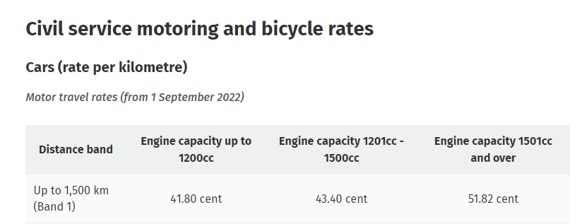

As an MVP this app is hardcoded for 2023, so the year is not taken into account for travel expenses. The user inputs just 3 items to record a travel expense

 The next image Reimbursement amount for each location by the car engine size, This table was helpful when testing the app for correct calculations of reimbursement amounts.

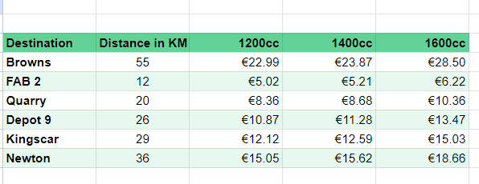

It seems that although there is widespread conversion to metric the term 'mileage rate' is still widely used when actually meaning rate per kilometer. If you come across this term in this README or code comments then its meaning is actually rate per kilometer.

## DESIGN PLANNING

Below is the initial work flow envisaged when starting work on this project.

### SCOPE
For this implementation of the travel expenses I have planned the following features

* Allow user to enter travel expenses in as easy a way as possible & calculate amount to be reimbursed for each trip
* Display warning/error when user enters invalid input & when/where possible give hint to the user as to what is valid
* Allow user to list the approved travel expenses and the list awaiting approval
* Allow manager to approve travel expenses in individual or group (Note as I will not be implementing user login, manager & user are not distinguisable)
* The program will work for 2023 year records only.

### Data Model

The database for this app will be held on a Google sheet. There are 3 worksheets used by the app :

1. EngineSize 
2. Distance
3. TravelExpenses

 EngineSize and Distance are static worksheets with prepopulated data to give the python app information needed to validate input & calculate reimbursment amount per trip. TravelExpenses is a dynamic worksheet updated by the app.

#### EngineSize
EngineSize : Car engine size of employees authorised to claim travel expenses;
Fields : 
`EMPLOYEE	ENGINE-SIZE-cc	ALLOWANCE-PER-KM`

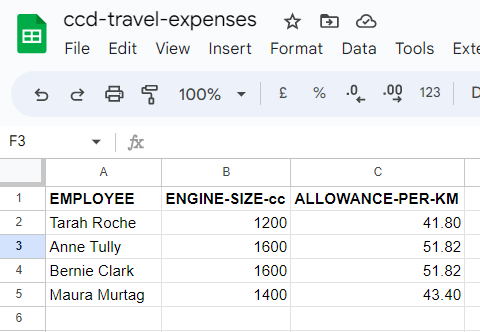

#### Distance

Distance : Round trip distance from office location to destination;
Fields : `DESTINATION	    DISTANCE-IN-KM`

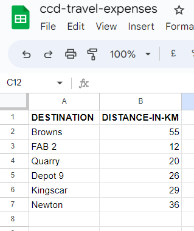

#### TravelExpense
TravelExpenses : Log of 2023 travel expenses/trip records;
Fields : `STATUS	 SUBMITDATE	EMPLOYEE	  DESTINATION	AMOUNT	TRAVELDATE	ID-NUM`

*NOTE : the ID_NUM field is auto generated when trip record added*

 The TravelExpenses worksheet is dynamic worksheet updated via the console in 2 separate processes.  First trip details entered via console which adds a new travel expense record to the worksheet, There is a unique ID assigned to each record & held in the last/G column of the worksheet, This ID is automatically added by the spreadsheet. The 2nd type of update is when travel expense/expenses are approved by an manager and they go from having a "Pending" status to "Approved" status in the first/A column.

#### Design Notes/observations
Itn this app here was not an use case for using creating Class structures so there are no OOP structures as I deemed it not appropriate for this project.
There is  CRUD  functionality in the creating, reporting on and updating the travel expense records & Custom error handling has been applied to majority of the datat input.  Unfortunatley due to time restrainst I unable to apply error and exception handling to the Y/N user input.  If there is a Y anywhere in the input it is taken as a Yes and anythiong else is treated as No.

## Goal 

*  the app should be easy to get around
*  info that appears on terminal should be relevent to what user is doing at that time
*  instruction should help the user determine what information is to be entered
*  the trip worksheet should be updated with correct values
*  the reports should list the correct records

### User stories 

As a user I want to...

* be able to submit a travel expenses record easily
* I want to know reimbursement amount
* add several records in a row
* run report to see what I entered
* run report to see whats already on database
* see how many are awaiting approval
---
## Features

### Main Menu

Main menu has 4 options as follows

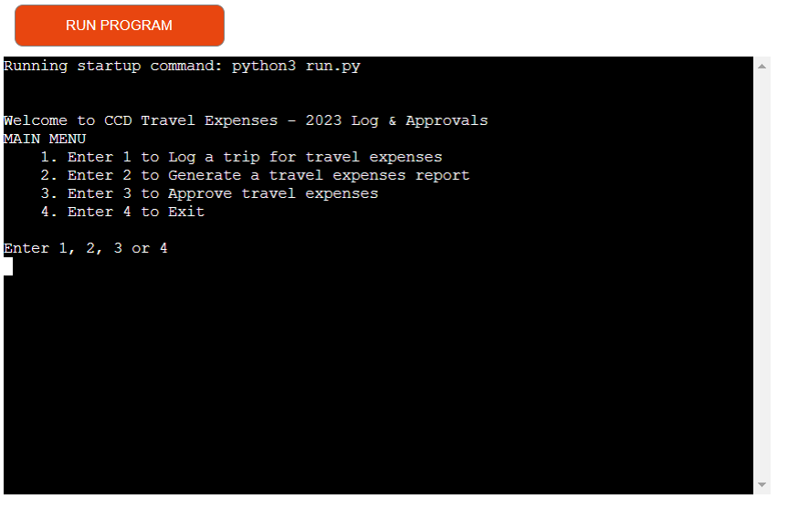

The only acceptable user input at this stage is a number between 1 and 4 (whitespace is stripped with `replace(" ", "")`),  Any other input is not accepted and user is advised accordingly, for instance blank input, non numeric input, numerics out of range...  - as shown here

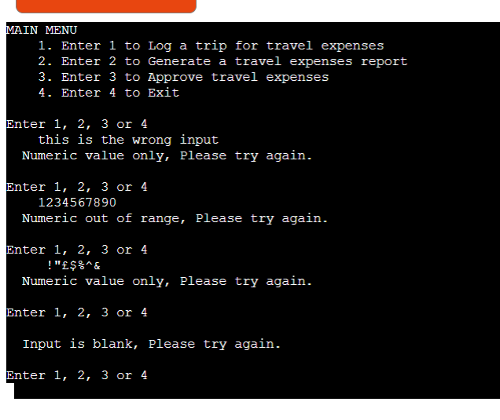

The user at this stage can pick one of 3 choices to do something or #4 to exit the program.  The 3 options are
1. To Log travel expense(s)
2. To generate travel expense report(s)
3. To approve travel expense(s)

Chosing #1 will bring the user to the following screen

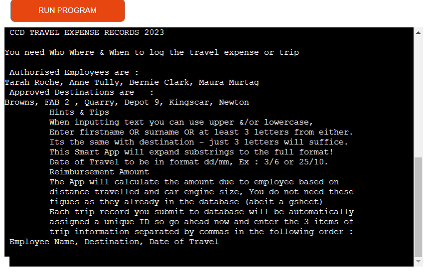

---
### Log Travel Expense(s) (Trip)

The user is presented with a screenful of information to assist in submitting travel expenses, There are restrictions such as only 4 employees can submit an expense and there are 6 locations approved, These details are held in the gsheet and displayed to the user in the first couple of lines. In order to make it easier for the user to enter a trip the app converts all inputdata comparasions to lowercase so it is case insensitive,  the user is advised of this and can use preferred case.  The user is also advised that if they can give just 3 letters of either the first name or surname of the employee, the app will be able to expand those 3 letters to the full employee name.  It does the same with destination & due to similarities i was able to condense this to one function called `expand_data()`.  The user is informed about how the reimbursement amount is calculated and that there is a unique identifier (NUM-ID) for each travel expense.  Below are some examples of  entering valid travel expense records 

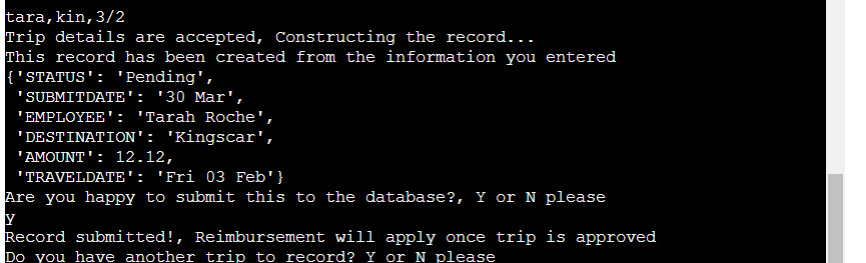
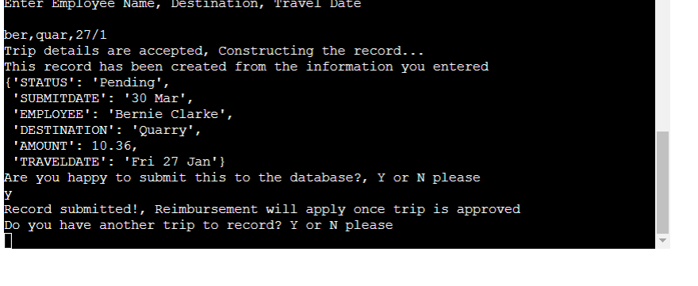
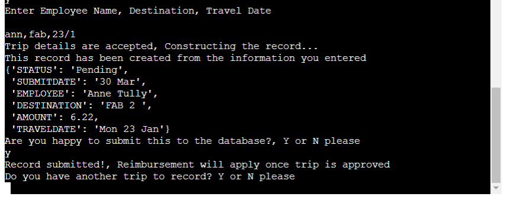
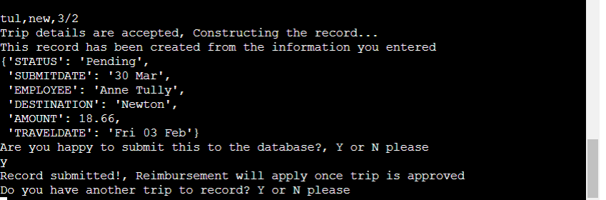

#### Error Handling for Logging Travel Expense
As mentioned there are 3 items input to log a trip - Who goes on the trip, Where do they go & the when. Each item has its own restrictions, such as who needs to be one of the 4 authorised employees, Destination needs to be one of 6 locations and the date - entered in dd/mm format -  needs to be a valid date month combination.  Here are examples of incorrect Employee, incorrect destination  & incorrect date :

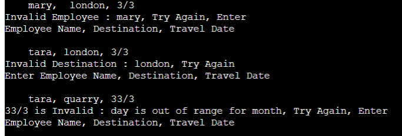

A `ValueError` is raised if user inputs less than 3 letters for either the employee or destination, or if there is less than 3 items input or if the user just pressed return, see examples below

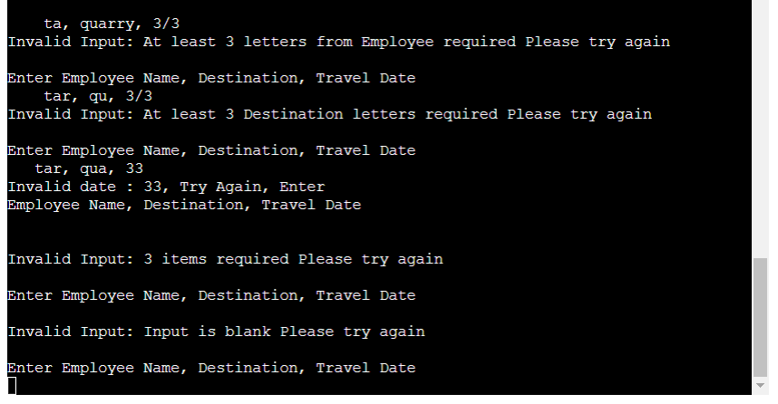

#### Seek users approval before submitting record 

Once the users input is accepted the app will construct a 'travel expense record' and seek the users approval before it is entered into the database.  This also give the user reimbursement amount for the first time. User has the option to say no to submitting to database.

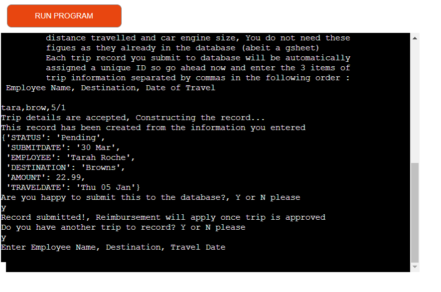

#### Enter Another Record

User can repeat entering travel expense records and when finished will be returned to main menu.  Again the y/n responses are not case sensitive.

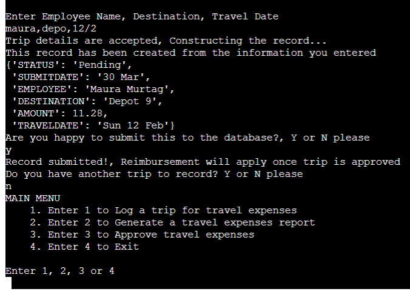

---
### Report Menu
The main report menu

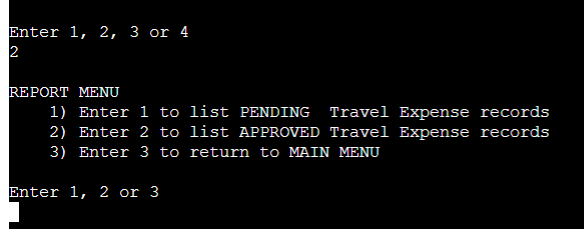

Report for Pending records

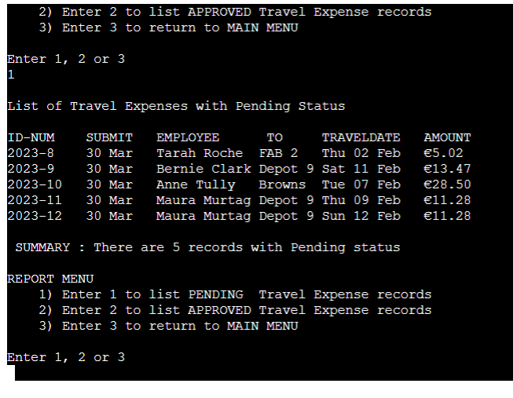

Report for Approved records

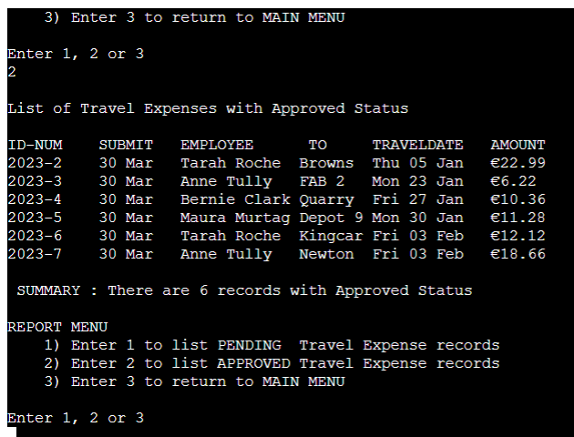

When there are no records...

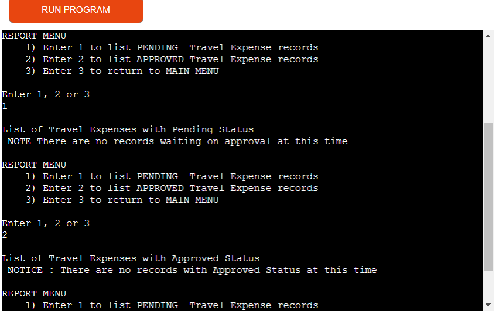

Return to the main menu

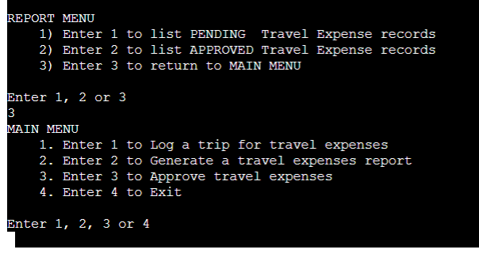

---

### Approvals Section

It is envisaged that this section would only be available to manager who is authorised to approve payment of the travel expenses, As an MVP there is not user login implemented in this app so it is generally available.

Example of records to approve

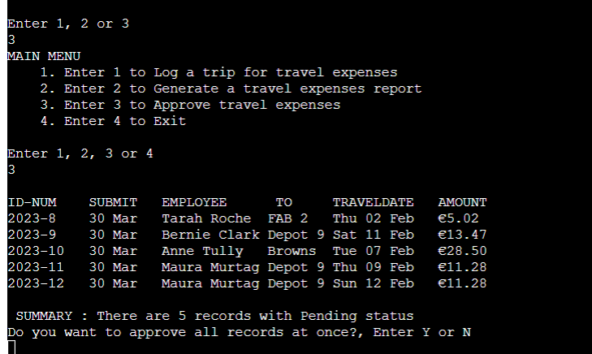
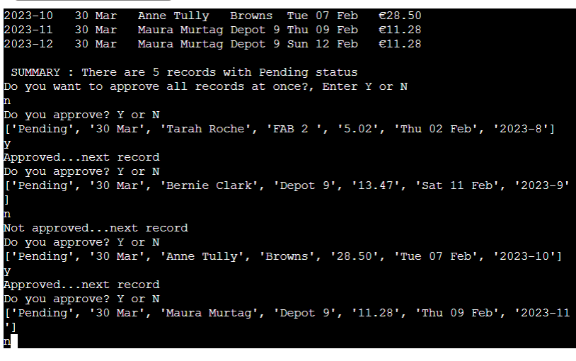

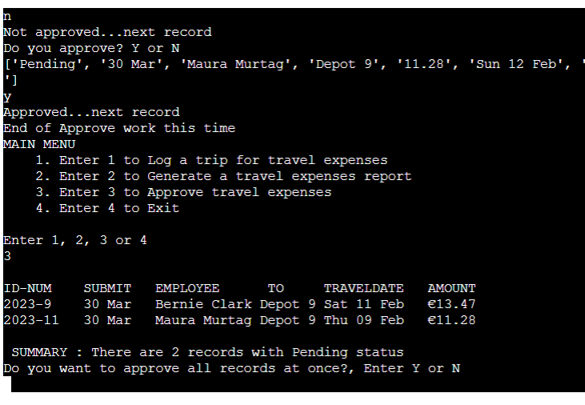

& Sometimes there is no work to do!!

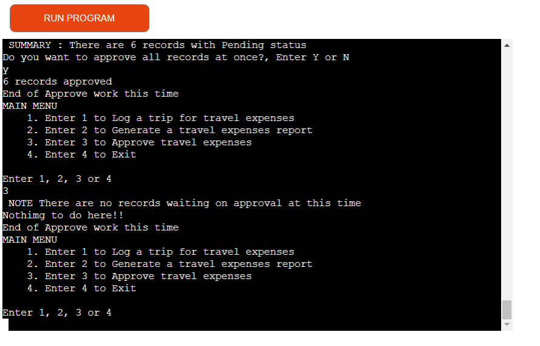

### Future Goals

* Import colorama to give red color to error text, yellow color to informtion text etc
* Expand the "Log" section to allow user to enter travel expenses for employees and locations not pre defined.
* Expand the reports section to list travel expenses by month, destination & employee, giving subtotals etc where appropriate.
* Expand the reports section to summarise travel expenses ie total monthly reimbursement etc
* Implement a user login with an audit trail
* Implement manager login that is only user allowed to approve expenses    
---
## Testing

## Check Goals if they are reached

*  the app should be easy to get around : YES
*  info that appears on terminal should be relevent to what user is doing at that time : YES
*  instruction should help the user determine what information is to be entered : YES
*  the trip worksheet should be updated with correct values :YES
*  the reports should list the correct records : YES

### User stories Testing

All User sTores tested and passed

* be able to submit a travel expenses record easily : Tested extensively with valid and invalid data
* I want to know reimbursement amount : Tested Calculations & all are correct
* add several records in a row : This is implemented, users get option to add another record
* run report to see what I entered : Users can run Pending report option 2 from main menu then option 1
* run report to see whats already on database : User can run Approved report, option 2 from main menu then option 2 again from report menu
* see how many are awaiting approval : option 3 on main menu and passed tests

All function were tested in gitpod before deployment.
At times here were some new functionality/ideas was explored in python visualizer before incorporating into run.py

#### manual

All function were tested in gitpod before deployment.
At times here were some new functionality/ideas was explored in python visualizer before incorporating into run.py

### Validator Testing
PEP8 - no errors returned from pep8online.com

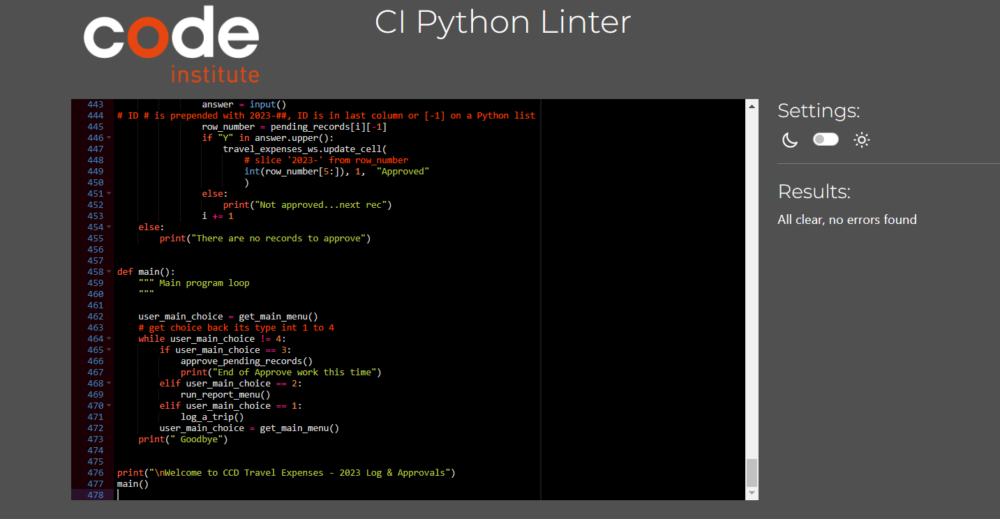

## Deployment

This application uses Heroku for deployment, To setup Heroku you need to do the following

1. Navigate to the Heroku website
1. Create an account by entering your email address and a password
1. Activate the account through the authentication email sent to your email account
1. Click the new button and select create a new app from the dropdown menu
1. Enter a name for the application which must be unique, in this case the app name is after-the-party
1. Select a region (in my case Europe)
1. Click create app

The project was deployed using Code Institute mock terminal for Heroku

Steps
1. Fork or clone this repo
1. Create a new Heroku app
1. Add config vars for CREDS and port in settings
1. Set the buildbacks to Python and NodeJS in that order
1. Link the Heroku app to the repo
1. Click on deploy

## Technology used

* Python with datetime & pprint standard libraries
* gspread - to allow communication with google sheets
* Github & Heroku for deployment
* google.oauth2.service_account : Credentials : used to validate and grant access to google service accounts
* lucid - flow charts

## Credits

* Code Institute LMS, & Slack Channels
* Gspread documentation https://docs.gspread.org/en/v5.7.0/
* Python Visualizer https://pythontutor.com/visualize.html#mode=edit
* MND https://developer.mozilla.org/en-US/
* W3Schools https://www.w3schools.com/
* Stack Overflow https://stackoverflow.com/
* CI for the mock terminal
* www.revenue.ie Motoring Rates fo travel expense rates
