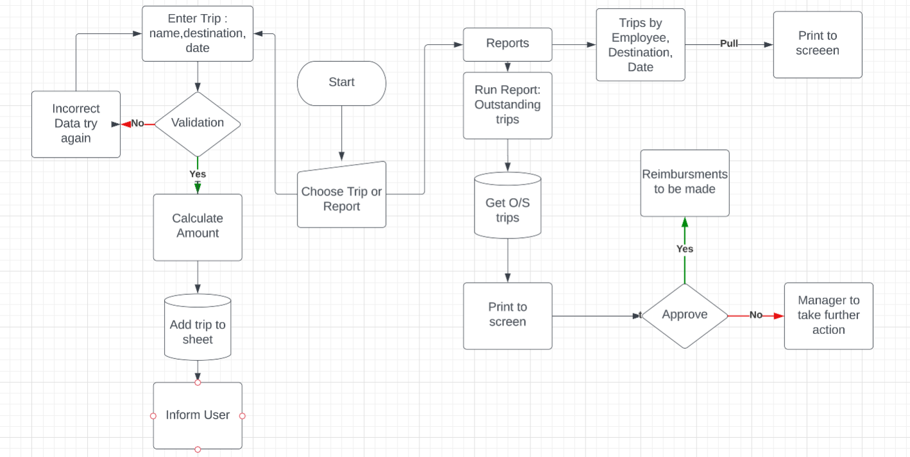

# CCD Travel Expenses Console App

Python Console app that automates logging and approval of CCD travel expenses using api to a gspread sheet.  CCD is a ficticious SME.

 pip3 install gspread google-auth dependencies that had to be installed

## Introduction
mileage rates
reimbursement to employee for work travel
payment can be made tax free by the amoutn of business km travelled, journeys to/from home cannot be clainmed as mileage.
There is a maximum mileage allowance per kilometre that the employer can reimburse tax-free. The mileage allowance rates depend on the type of vehicle. These maximum amounts are based on the Civil Service rates and can be found on the website of the Irish Revenue. Cars Motor travel rates 

CCD is a fictional SME which reimburse 4 employees when they use their private car for business purposes. They follow the Civil Service rates from www.revenue.ie. The rate per KM is dependant on the engine size of the employees' car.
This payment can be made, tax free, by the amount of business kilometres travelled. You can either:

## Goal = UX/UX + user story

*  the app should eb easy to navigate
* info that appears on terminal should eb relevent to what user is doing at that time
* instruction should help the user what info is to be entered
*  the releven worksheets should be accessed when needed
* the trip worksheet should eb updated with correct values
* the reports shouls list the correct records

### User stories 

as a user i want to...

* be able to submit a travel expenses record easily
* I want to know reimbursement amount
* Add several records in a row
* run report to see what i just entered
* run report to see whats already on datasheet for this month
* see how much travel expenses are by month
* see how many are awaiting approval

### SCOPE
for this implementation of the travel expenses i ahve planned the following features
* display warning/error when user enters invalid input
* app to calculate amoutn for each trip

## Features
existing & future
## Data Model
A google sheet was used to store the trips. The sheet consists of 3 worksheets, "Employee", "Distance" & "Trip".  Employee and Distance are static worksheet that give python information needed to calculate the reimbursment amount per trip. Trip is dynamic worksheet updated via the console in 2 seperate processes.  First trip details entered via console. 2nd Trip approved by manager so reimbursment can be arranged.
#### NOTES
did not use pandas as very simple and small spreadsheet only with 5/6 columns, travel expenses will of coarse grow 
Did want to have user inpit on same line as request and foiund i could use end="" as 2nd argument to print function BUT then thought that i ahve to put a /n on all print and input statments for some "quirk" on terminal so can't do this
###
OOP - need to mention that not used OOP as simple worksheet
Did use CRUD & Custom error handling

### manual testing - test each feature, each user story each purpose
### Exception Handling
on input

## Testing What to test 
#### manual
 test each feature, each user story each purpose
#### code validaiton incl screenshots pep8online with no errors or warnings
#### error handling tests
user submit empty innput
ensure error message are informative

ie
I ahve implemented the validate_data method that is called at every step of the ordering process for validaitn input fo the suer, mentod can be adapted to number of menu items by changing vakue of its parameters
the vlaue parameter gets the 
this heature was tested by simulating the error

blank input
non numeric input
..show screenshots
#### test user stories
table with user stories one column and testing on other column which in Tipsslideshow is just how to do what the user wants rather than how to test (and maybe outcome)

### test features

table with these headings
feature action effect

Real time information from the google spreadsheet
tested by comparing the output from the terminal for X report with the content that exists at that time in the corresponding worksheet
 & if there is changes to the worksheet that the ouytput to terminal is changed

 so will need to confirm calculations are correct
 confirm that ssheet is updated correctly
 this si part of FEATURE testing

## Bugs record all bugs, state what was the problem & if solution include screenshots

TypeError: Object of type datetime is not JSON serializable

Future Features :

if the client liked the app then i would suggest having more meangingful menu pick options  rather than numeric 1,2,3 ie A for Approve, P for Pending L for log a trip
but this is just MVP to give client idea of what can be done

### Validator Testing
PEP8 - no errors returned from pep8online.com

## Deployment
The project was deployed using Code Institute mock terminal for Heroku

Steps
fork or clone this repo
creat a new Heroku app
set the buildbacks to Python and NodeJS in that order
Link rhe Heroku app to the repo
click on deploy

## TEchnology used

gspread - allows communication with google sheets
colorama -??? TBD
google.oauth2.service_account : Credentials : used to validate and grant access to google service accounts
lucid - flow charts

## Credits
CI for the mock terminal

## Reminders

* Your code must be placed in the `run.py` file
* Your dependencies must be placed in the `requirements.txt` file
* Do not edit any of the other files or your code may not deploy properly

## Creating the Heroku app

When you create the app, you will need to add two buildpacks from the _Settings_ tab. The ordering is as follows:

1. `heroku/python`
2. `heroku/nodejs`

You must then create a _Config Var_ called `PORT`. Set this to `8000`

If you have credentials, such as in the Love Sandwiches project, you must create another _Config Var_ called `CREDS` and paste the JSON into the value field.

Connect your GitHub repository and deploy as normal.

## Constraints

The deployment terminal is set to 80 columns by 24 rows. That means that each line of text needs to be 80 characters or less otherwise it will be wrapped onto a second line.

-----
Happy coding!